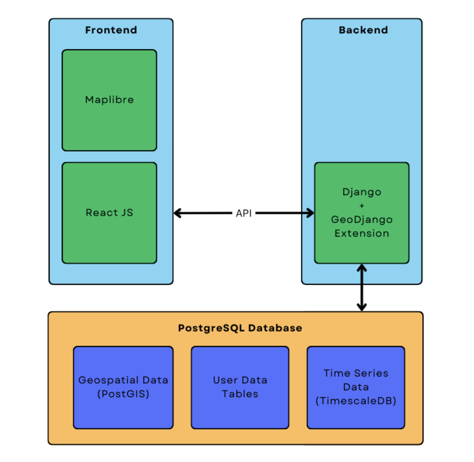

# README

| CoS-iT-FloWS Links & Badges              |                                                                             |
|------------------------|----------------------------------------------------------------------------------------------------------------------------------------------------------------------------------------------------------|
| CoS-it-FloWS Documentation      |         |
| License                |                                                               |
<!-- | Current Release DOI    |  | -->

----------

## Table of Contents

+ [About](#about)
+ [Overview](#overview)
+ [Key Features](#key-features)
+ [Tech Stack](#tech-stack)
+ [Usage](#usage)
+ [License](#license)
+ [Help and Support](#help-and-support)

## About

This repository serves as the public source code repository of the **Community Sourced Impact Based Flood Forecast and Early Warning System**, termed **CoS-IT-FloWS**.The CoS-IT-FLoWS documentation can be read [here](https://cos-it-flows-documentation.readthedocs.io/en/latest/).

CoS-IT-FloWS is being developed at EQUINOCT Community Sourced Modelling Solutions, hereafter referred to as EQUINOCT, under the UNICEF Office of Innovation's Venture Capital Fund that supports and guides their inaugural climate cohort of 8 startups from around the world to build Open Source technological solutions for sustainable climate action.
All development activity is coordinated through the [CoS-IT-FloWS github page](https://github.com/COS-IT-FLOWS), where you can also find all archived, current, beta, and development versions of the system.

## Overview

EQUINOCT is an early stage tech start-up formed in July 2020, that aims at building community data portals in data scarce regions that can facilitate real-time visualization, analysis,monitoring, and impact-based early warnings of climate change impacts using data sourced from communities through building local community partnerships.

CoS-IT-FloWS is a Decision Support System [Model](./Model) that integrates hyper-local real time monitoring to provide river basin level impact based flood forecasting and multi-hazard warnings. It aims at leveraging meterological and infrastructural data such as rainfall, groundwater and reservoir levels to accurately predict region-wise flood probability, utilizing both hydrological and machine learning approaches for a hyper local forecast system.

## Open Source

We encourage any users who have modified (or would like to modify) CoS-IT-FloWS, either to fix bugs or develop new features, to contact us and coordinate development work with us. The CoS-IT-FloWS system source code is archived in Git and is publicly available through GitHub. To access the source code, visit GitHub, create an account, and visit [github.com/COS-IT-FLOWS/COS-IT-FLOWS_app](https://github.com/COS-IT-FLOWS/COS-IT-FLOWS-Documentation).

CoS-IT-FloWS is an open source development model and is released under the terms of the [MIT License](./License.md).

Instructions for using Git and GitHub to access the CoS-IT-FloWS code and contribute changes are here:

[Working with GIT and GitHub](./UserGuide.md)

## Key Features

1. Community weather data collection app "Gather" : to collect hyper local data and made using Flutter framework.

2. Web-Based Real-Time Rainfall and Weather Monitoring Dashboard : utilizing AI models for dynamic visualization and interactive maps to provide insights into climate data trends and forecasting.

3. Open Source Backend Code: Promoting transparency and collaboration for users to leverage our ML-based climate analytics.

4. River basin level impact based flood forecasting system.

5. Multi-hazard warning system: issued to communities and local authorities alike.

## Tech Stack

**Frontend:** React.JS + Maplibre

**Backend:** Django

**Database:** PostgreSQL

## Usage

Each new implementation addresses new problems and conditions that the system may not currently be able to handle, and as such the system is always under development. CoS-IT-FloWS is an open source development project, which means that contributions are welcome, including to the CoS-IT-FloWS documentation.

By placing the original source code archive on GitHub, we hope to encourage a more collaborative development environment. A guide on how to use the CoS-IT-FloWS git repository and [how to contribute](./Contribute.md) your changes to the system can be found on the git page. The most stable version of the system is in the main branch, while beta versions of releases under development can be obtained from the development branches of this repository.

CoS-IT-FloWS has an incremental nature of development due to which not all sections of the code are equally mature and not every combination of system options has been exhaustively tested or is guaranteed to work. While you are more than welcome to use CoS-IT-FloWS in your own research and development undertakings, the system code comes with no guarantees, expressed or implied, as to suitability, completeness, accuracy, and any other claim you would like to make.

If you make use of this system, please acknowledge all references appropriate to the features you used that are cited in the [References Page](./References.md).

## License

CoS-IT-FloWS is released under the [MIT License](./LICENSE.md).See the `License` file for more information.

The CoS-IT-FloWS documentation content is licensed under a [Creative Commons Attribution-ShareAlike 4.0 International License](https://creativecommons.org/licenses/by-sa/4.0/).

## Help and Support

If you have any questions, feedback, or suggestions, please feel free to reach out to us at <team@equinoct.com>. You can raise an issue in the issue tracker.

